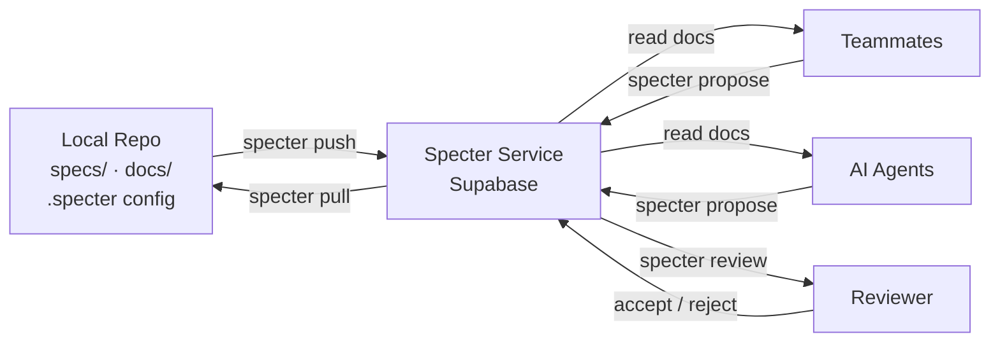

# Specter

A Go CLI for syncing markdown documents with the Specter service. Single binary, git-aware, branch-namespaced.

## Architecture



## Installation

```bash
go install github.com/hiasinho/specter@latest
```

Or build from source:

```bash
go build -o specter .
```

## Configuration

Create a `.specter` file at your repo root:

```yaml
project: owner/slug
paths:
  - specs/
  - docs/architecture/
exclude:
  - specs/drafts/
  - "**/_wip_*.md"
```

- `project` — required, `owner/slug` format
- `paths` — required, directories to scan for markdown files
- `exclude` — optional, glob patterns to skip

Set your auth token:

```bash
export SPECTER_TOKEN="your-hex-token"
```

## Commands

### Account

```bash
specter register --email you@example.com --username alice --invite-code <code>
# Prints your token — save it, it won't be shown again

specter me
# Show current user info and available invite codes
```

### Projects

```bash
specter init [--name "Display Name"]
# Create the project defined in .specter on the service

specter projects
# List projects you are a member of

specter project delete <owner/slug> [--force]
# Delete a project and all its data (prompts for confirmation unless --force)
```

### Sync

```bash
specter push               # Push local documents to the service
specter push --force       # Skip conflict detection (last write wins)

specter pull               # Fetch latest documents from the service
specter pull --force       # Overwrite local changes without prompting

specter status             # Show local/remote differences
specter diff               # Line-level diff for all changed files
specter diff specs/foo.md  # Diff a specific file
```

Push detects server-side conflicts — if documents were modified remotely since your last pull, the push is rejected. Run `specter pull` first, then push again. Use `--force` to bypass conflict detection entirely.

Pull skips files with local changes and prints a warning. Use `--force` to overwrite them.

### History

```bash
specter history <path>                          # List revision history (default: last 10)
specter history <path> --limit 25               # Show more revisions
specter history <path> <revision>               # Show content at a specific revision

specter history diff <path> --from <rev>        # Diff from a revision to latest
specter history diff <path> --from <rev> --to <rev>  # Diff between two revisions
```

### Proposals

```bash
specter proposals                              # List pending proposals
specter proposals --status=accepted            # Filter by status (pending|accepted|rejected)
specter proposals --document=specs/foo.md      # Filter by document

specter propose specs/foo.md \
  --type replace \
  --anchor "text to anchor to" \
  --line 42 \
  --body "proposed replacement text"
# --type is required: replace|insert|delete|note
# --anchor and --body are required; --line is optional

specter review <proposal-id> accept
specter review <proposal-id> reject
```

Pending proposals are surfaced automatically during `pull` and `status`.

### Invites

```bash
specter invite create [--role reader]
# Create an invite code for the current project
# Roles: editor | reviewer | reader (default: reader)

specter invite redeem --code <invite-code>
# Join a project using an invite code
```

### Agent instructions

```bash
specter skill              # Print agent instructions to stdout
specter skill --install    # Append instructions to AGENTS.md
```
